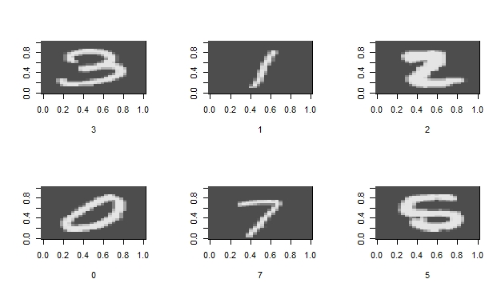
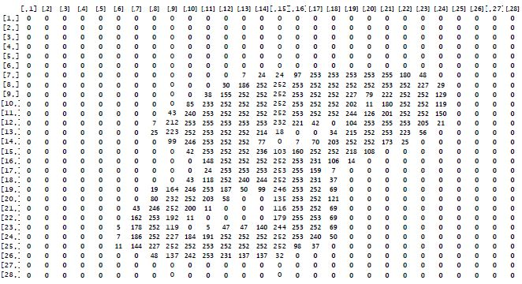
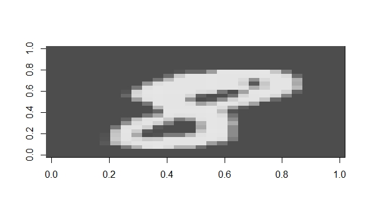

# DigitRecognition

Algorithms that are tested:
- KNN;
- FNN;
- Naïve Bayes;
- SVM;
- KSVM;
- RPart (Recursive Partitioning and Regression Trees);
- Random forest;
- Neural Network;
- t-SNE.

Train data is found on www.kaggle.com and can be downloaded freely. The dataset must be included in the active directory before executing the code.

*Example digits extracted from the MNIST dataset (train dataset):*

*A few random digits extracted from the MNIST dataset (train dataset) presented in black and white:*

**Digit 8 presented in pixel values (0 - 255). Each row of the training dataset represents a single handwritten digit. In order to visualize the digit, the row must be converted into a 28x28 pixel matrix. **

**Digit 8 presented in black and white: **

